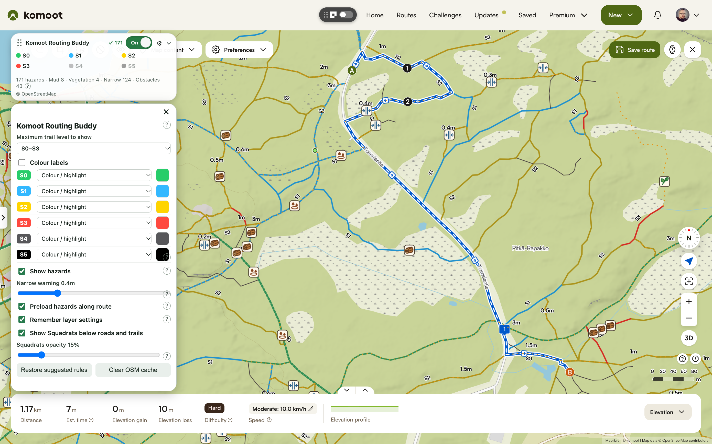
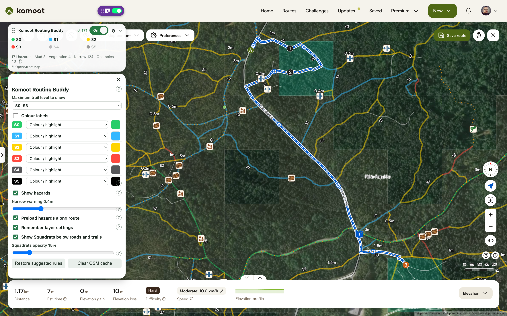
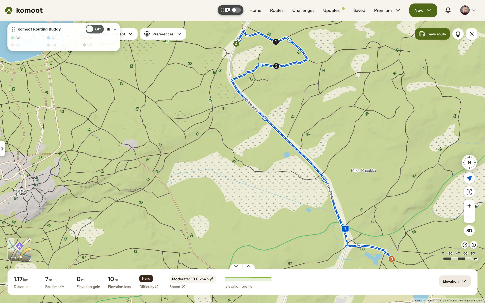

# Komoot Routing Buddy

Komoot Routing Buddy makes mountain bike trail difficulty easier to read on Komoot maps using colours. You can choose which difficulty levels to show and their colours. It also displays hazards mapped in OpenStreetMap, such as mud, fallen trees, vegetation, and narrow sections. You can also reduce the opacity of the Squadrats plugin. It does not modify your route.

## Features

- Highlights trail difficulty directly on the map
- OSM integration: Shows hazard overlays for muddy, narrow, and other mapped trail issues
- Lets you choose which difficulty levels are shown
- Supports custom colors for each trail difficulty (brighter in Sat view)
- Adds a clear warning style for the hardest sections
- Keeps your preferred map and panel settings between sessions
- Lets you switch back to the original Komoot styling whenever you want
- Works with the main planning and editing views in Komoot

## Known Issues

- OpenStreetMap Overseer API is often overloaded, which can make trail hazard data take a long time to load, sometimes several minutes. Because of this, the loading status is shown in the floating window so you can see whether hazard data is still being fetched or is delayed. Succesfully loaded OSM data is cached for 7 days.

## Preview

### Default map

### Satellite map with Squadrats opacity @ 15%

### Default Komoot map without this extension (for comparison)

## Install

### Chrome / Brave

1. Download the latest version from the [Releases page](https://github.com/redfellow/komoot-routing-helper/releases) (or download source)
2. Open `chrome://extensions` or `brave://extensions`.
3. Enable Developer mode.
4. Click Load unpacked and select the generated extension directory.
5. Open Komoot and use the extension from the route planner.

### Firefox

1. Download the latest version from the [Releases page](https://github.com/redfellow/komoot-routing-helper/releases) (or download source)
2. Open `about:debugging#/runtime/this-firefox`.
3. Click Load Temporary Add-on.
4. Select the generated `manifest.json` for the Firefox build.
5. Open Komoot and use the extension from the route planner.

## Notes

- This is a visual helper only.
- It does not modify your route or create a route for you.
- It is designed to make map reading easier, especially for MTB planning.

## Privacy and data handling

The extension stores your local preferences in the browser and reads the page state needed to apply the visual styling. It does not upload routes or personal ride data to a remote service. Show hazards is enabled by default: at close zoom levels it sends the viewed map bounding box sequentially to Private.coffee, VK Maps, or overpass-api.de to retrieve OpenStreetMap obstacles, vegetation, mud, warnings and width data. The provider also receives normal network metadata such as your IP address. Turn off Show hazards in settings to stop these lookups. Missing tags mean unknown conditions; this is not live trail-condition reporting.

## For developers and maintainers

Technical build, test, and release information has been moved to [READMORE.md](READMORE.md). The release checklist and distribution notes are also documented in [docs/RELEASING.md](docs/RELEASING.md).

New OSM queries include up to a 20% margin on each side within the 25 km² limit. Cached areas serve any fully contained viewport, including nearby pans and zooms. Counts refer to the returned cached area. Successful OSM results are cached locally for 7 days (stored per area in IndexedDB, with a 512 MiB serialized-data budget and a 4,096-area limit, evicting least recently used areas first). Failed responses are not cached. Use Clear OSM cache in settings to discard stored results and reload the current view. The floater header shows loading, completed, and throttled request states and the number of distinct mapped hazard features. The detailed count uses under 1 metre for narrow trails; categories can overlap.

Optional **Preload hazards along route** caches up to eight roughly 1km route cells
with a 300m margin, starting near the current map view. Queries run sequentially
after route edits settle; viewport requests take priority between preloads.
Queued areas are replaced after route edits or panning, and preloading stops on
API errors. Adjacent cached areas can jointly satisfy a viewport request.
Only area bounds are sent to the existing OSM providers; enabling this option
can send bounds outside the visible map. It is off by default.

### Check trails along a route

The Check trails button beside the settings cog opens a trail checker for the current Komoot route. Defaults are maximum **S1**, minimum width **0.4m** (adjustable from 0.1–1m), and **Allow hazards** unchecked. These preferences are independent of the map display settings and are remembered.

**Check trails** assesses unpaved paths and tracks with an OSM MTB scale. Roads, streets, cycleways and paved paths are excluded. Unpaved paths without an MTB scale are reported as unknown; MTB-rated paths without a surface tag are assumed unpaved and assessed. Missing surfaces on unrated paths, and unrecognised or mixed surface tags, remain unknown and are not assessed. It uses cached OSM trail data and queries missing areas along the route, including areas outside the viewport. Unmatched sections are not checked and are not added to the trail unknown-distance totals. It checks difficulty, widths below your minimum, and mud, vegetation and obstacles. Allow hazards suppresses obstacle/surface warnings while retaining difficulty and width checks. Estimated widths are labelled; S1+ exceeds an S1 maximum, while S1− does not.

Warnings are ordered by distance from the start. Click one to center/zoom the map and highlight the affected section for eight seconds. Cancel stops further collection; an already running request may finish and remain cached. Temporary failures retry automatically from the failed area for ten minutes without progress, respecting provider cooldowns (at least 30 seconds between retries). Each completed area resets that window, so a progressing check can run longer. Cancel interrupts retry waits. If automatic retries are exhausted, Retry resumes the retained checkpoint. Editing the route invalidates its previous results.

The current Komoot route source provides geometry, not OSM way IDs or difficulty ratings. Matching uses direction and sustained overlap with OSM trails. Close competing ways, short ambiguous sections, off-grid segments and paths without usable data are reported separately as unknown. Width/difficulty information can be missing even when all queries succeed. The checker does not modify routing or infer that unknown sections are suitable.

Route-complete cache entries include unrated paths and trails without hazard tags. Older hazard-only entries remain useful for the map but must be fetched once in the richer format before they can satisfy a route check. A completed check with assessed trails and no warnings says: “No issues found on matched trails according to Komoot & OSM data.” Missing-data information remains visible below that result.

OSM cache reads load only the required area, never rewrite its geometry, and keep a small 16 MiB hot-data cache (serialized size) in memory. Startup loads just the area index. The surviving entries from the old cache migrate automatically; areas it previously evicted must be downloaded once again. Route-check progress distinguishes cached areas from downloaded ones. **Clear OSM cache** removes both disk and memory data.

The extension requests `unlimitedStorage` for its larger local OSM cache while imposing the above application limits. See the [Chrome storage documentation](https://developer.chrome.com/docs/extensions/develop/concepts/storage-and-cookies) and [Firefox permissions documentation](https://developer.mozilla.org/en-US/docs/Mozilla/Add-ons/WebExtensions/manifest.json/permissions#unlimited_storage).

Route checking runs up to two downloads concurrently on different providers and combines up to four adjacent uncached areas per download (up to 8 km² before padding). Cached areas are reused, and failed combined downloads retry with smaller areas. Progress counts route areas, so one successful download can advance several steps.

Trail classification uses OSM way type and surface tags, not Komoot’s summary categories. Older route cache entries missing these fields are refreshed once when needed; they remain usable for map display. If no MTB-rated unpaved trails are identified, the checker says so instead of reporting a successful trail assessment.

### Local Finland data and updates

Open **Local Finland data** in extension settings to import a prepared snapshot or update Finland data from the public Geofabrik extract. Weekly automatic updates are enabled by default once a snapshot is installed. They use a temporary background tab, keeping the previous data available until validation finishes. Pause or close the tab to resume later. Expect a roughly 770 MB source download and several minutes of processing; allow several GB of temporary disk space.

**Update current route from OSM** in the trail checker deliberately fetches fresh online data along the current route. It confirms first and retains successful areas for seven days, including empty results, until a newer Finland snapshot supersedes them. **Clear OSM cache** removes these overrides too; it does not remove the Finland snapshot. See [local update details](docs/LOCAL-OSM-UPDATES.md).
